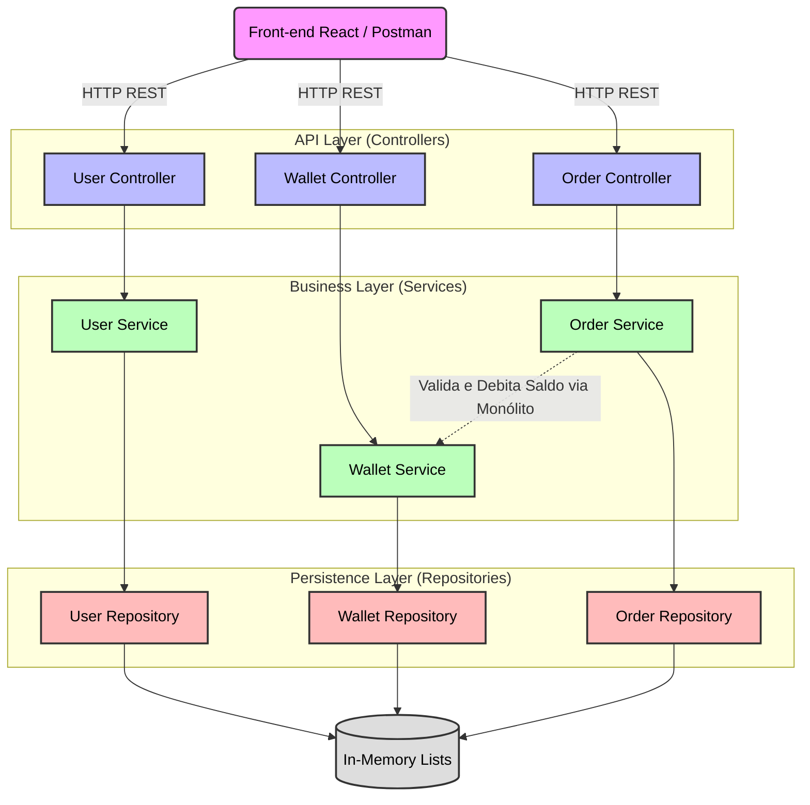
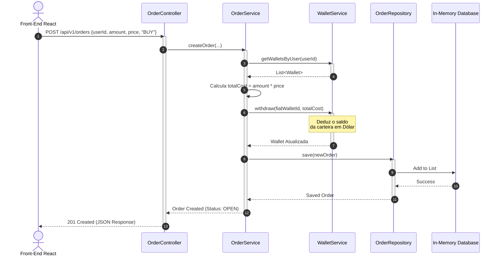

# Exchange API - Monólito Simples (TP1)

Este projeto é a primeira entrega da disciplina de Engenharia de Softwares Escaláveis, focado no desenvolvimento da estrutura base de uma aplicação monolítica em Spring Boot para o mercado de criptomoedas, preparando o terreno para futuras evoluções.

## 🛠️ Tecnologias e Versões Utilizadas

Este projeto foi desenvolvido utilizando as seguintes tecnologias e práticas arquiteturais:

### Back-End

* **Linguagem:** Java 25
* **Framework:** Spring Boot 4.0.6
* **Gerenciamento de Dependências:** Maven
* **Bibliotecas Principais:**
  * `Spring Web` (APIs RESTful)
  * `Spring Security` (Autenticação e Proteção de Rotas)
  * `Spring Boot Validation` (Validações de DTOs com Jakarta)
  * `Lombok` (Redução de código boilerplate)

### Front-End (Interface do Usuário)

* **Biblioteca Base:** React (v18+) com TypeScript (tipagem estática rigorosa).
* **Build Tool & Bundler:** Vite (configuração rápida e variáveis de ambiente).
* **Roteamento:** `react-router-dom` com implementação de rotas privadas (proteção de acesso ao painel administrativo).
* **Estilização e UI:** Tailwind CSS para estilização utilitária ágil e responsiva, juntamente com `lucide-react` para iconografia moderna.
* **Arquitetura e Boas Práticas:**
  * Componentização: Divisão clara entre `pages`, `components`, `hooks` e `types`.
  * Separação de Responsabilidades: Uso de Custom Hooks (como `useUsers`) para isolar regras de negócio, controle de estado e chamadas à API da camada de visualização.
* **Comunicação e Resiliência (Mock Mode):**
  * Consumo da API REST através de chamadas assíncronas com `fetch`.
  * **Sandbox Local (Fallback):** Mecanismo automático que detecta quando o backend está offline e ativa um modo de simulação em memória. Isso permite testar 100% das operações de CRUD na interface visual sem dependência do servidor ativo.
* **UX (Experiência do Usuário):**
  * Sistema próprio de notificações flutuantes (Toast) com temporizadores e animações.
  * Monitoramento em tempo real do status da API (Ping a cada 30s).
  * *Empty States* dinâmicos que orientam o usuário caso o banco ou simulador estejam vazios.
  * Autenticação simulada baseada em `localStorage`.

### Arquitetura e Padrões

* **Design de Software:** Adoção do padrão **Monólito Modular** (*Modular Monolith*) com Arquitetura em Camadas (Controller, Service, Repository), garantindo a separação de responsabilidades e a correta injeção de dependências (Princípios SOLID).
* **Domain-Driven Design (DDD):** Isolamento lógico através de *Bounded Contexts* (`User`, `Wallet`, `Trade`), estruturando o código em torno do domínio de negócios para manter a coesão e facilitar uma futura transição para microsserviços.
* **Estratégia de Persistência (Escopo TP1):** Implementação de repositórios baseados em memória (`ArrayList`) com geração autônoma de identificadores únicos (`UUID`), garantindo o funcionamento estrito do CRUD e simulação de estado sem o acoplamento a um banco de dados real nesta fase.
* **Design de API:** Construção de uma API RESTful *Stateless* (sem guarda de sessão no servidor), retornando respostas padronizadas e códigos de status HTTP adequados para cada operação.
* **Tratamento de Exceções:** Uso de um Interceptador Global (`GlobalExceptionHandler`) para a captura padronizada de violações de regras de negócio (`IllegalArgumentException`), falhas de validação e recursos não encontrados (`ResourceNotFoundException`).
* **Padrões de Projeto Aplicados:** *DTO (Data Transfer Object)* para segurança e controle do tráfego de dados nas requisições/respostas, e *Builder Pattern* para a instanciação limpa e imutável das entidades do domínio.

## 📊 Arquitetura do Sistema

Abaixo estão os diagramas que ilustram a separação de responsabilidades e o fluxo de dados da nossa API.

### 1. Diagrama de Componentes

Este diagrama demonstra o design da aplicação baseado em camadas (Controller, Service, Repository) e a separação dos contextos delimitados (User, Wallet, Trade).

### 2. Diagrama de Sequência (Caso de Uso: Nova Ordem de Compra)

O fluxo temporal abaixo ilustra a comunicação síncrona entre o motor de negociação (Trade) e a carteira do usuário (Wallet) no momento de uma compra.

