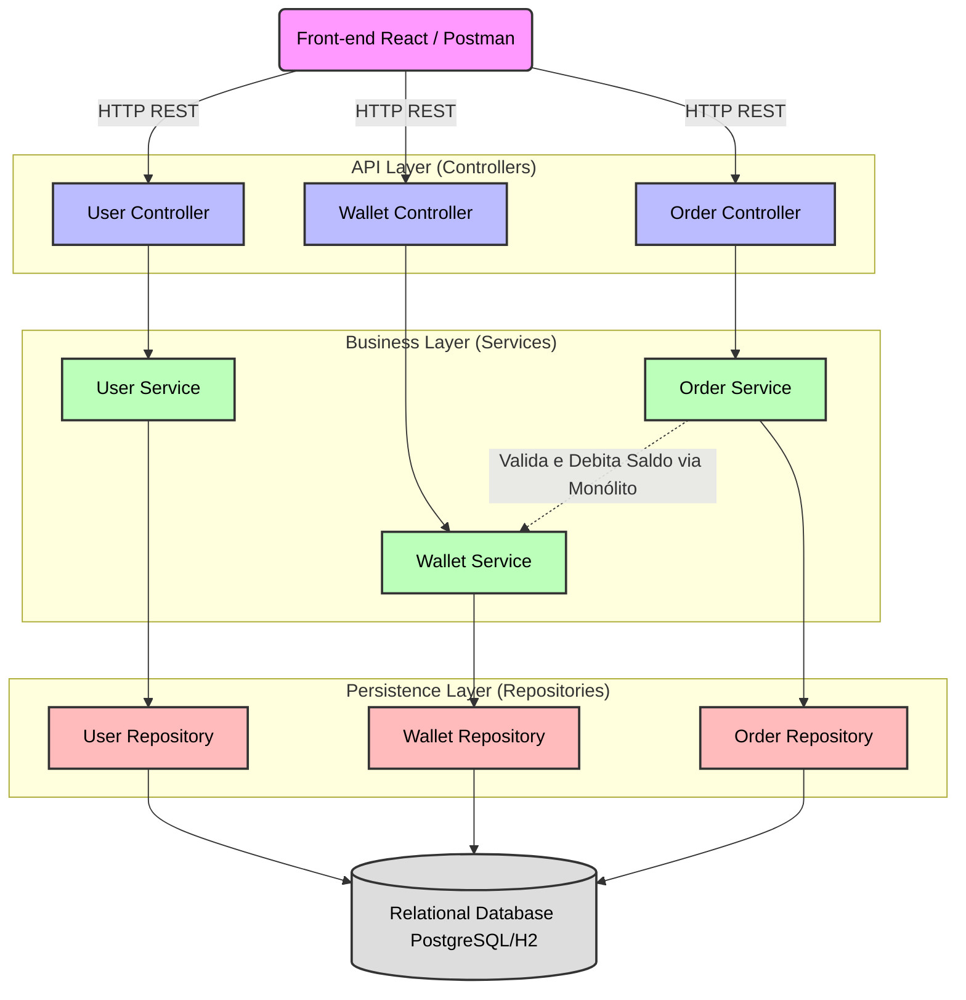
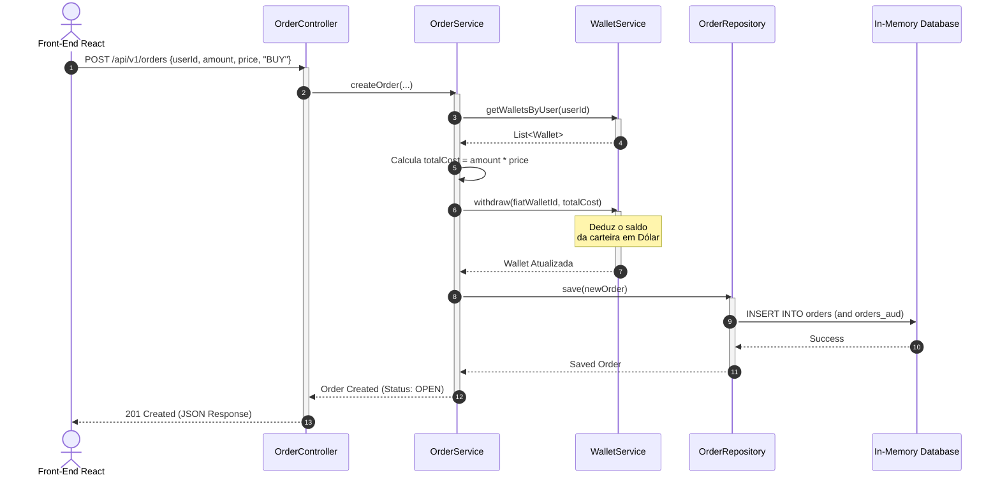

# Exchange API - Monólito Simples com Persistência (TP2)

Este projeto é a primeira entrega da disciplina de Engenharia de Softwares Escaláveis, focado no desenvolvimento da estrutura base de uma aplicação monolítica em Spring Boot para o mercado de criptomoedas, preparando o terreno para futuras evoluções.

---

## 🛠️ Tecnologias e Versões Utilizadas

Este projeto foi desenvolvido utilizando as seguintes tecnologias e práticas arquiteturais:

### Back-End

* **Linguagem:** Java 25
* **Framework:** Spring Boot 4.1.0
* **Gerenciamento de Dependências:** Maven
* **Bibliotecas Principais:**
  * `Spring Web` (APIs RESTful)
  * `Spring Security` (Autenticação e Proteção de Rotas)
  * `Spring Boot Validation` (Validações de DTOs com Jakarta)
  * `Lombok` (Redução de código boilerplate)
  * `Spring Boot Actuator` (Saúde da API)

### Front-End (Interface do Usuário)

* **Biblioteca Base:** React (v18+) com TypeScript (tipagem estática rigorosa).
* **Build Tool & Bundler:** Vite (configuração rápida e variáveis de ambiente).
* **Roteamento:** `react-router-dom` com implementação de rotas privadas (proteção de acesso ao painel administrativo).
* **Estilização e UI:** Tailwind CSS para estilização utilitária ágil e responsiva, juntamente com `lucide-react` para iconografia moderna.
* **Arquitetura e Boas Práticas:**
  * Componentização: Divisão clara entre `pages`, `components`, `hooks` e `types`.
  * Separação de Responsabilidades: Uso de Custom Hooks (como `useUsers`) para isolar regras de negócio, controle de estado e chamadas à API da camada de visualização.
* **Comunicação e Resiliência (Mock Mode):**
  * Consumo da API REST através de chamadas assíncronas com `fetch`.
  * **Sandbox Local (Fallback):** Mecanismo automático que detecta quando o backend está offline e ativa um modo de simulação em memória. Isso permite testar 100% das operações de CRUD na interface visual sem dependência do servidor ativo.
* **UX (Experiência do Usuário):**
  * Sistema próprio de notificações flutuantes (Toast) com temporizadores e animações.
  * Monitoramento em tempo real do status da API (Ping a cada 30s).
  * *Empty States* dinâmicos que orientam o usuário caso o banco ou simulador estejam vazios.
  * Autenticação simulada baseada em `localStorage`.

---

## 🗺️ Modelagem Estratégica DDD: Domínios, Subdomínios e Bounded Contexts

Para projetar a API da Exchange, foi dividido o problema de negócio utilizando a modelagem estratégica do **Domain-Driven Design (DDD)** que permitiu separar as regras complexas de execução de transações da infraestrutura básica de gerenciamento de contas e saldos.

### 1. Espaço de Problema (Domínios e Subdomínios)

* **Core Domain (Domínio Central):** `Motor de Negociação (Trade / Exchange)`
  * O coração do produto, onde o valor é entregue diretamente ao cliente através da execução de ordens de compra e venda de criptomoedas de forma ágil e segura.

* **Supporting Subdomain (Subdomínio de Suporte):** `Identity & Access (Gestão de Usuários)`
  * Essencial para o funcionamento do sistema financeiro (identificação do cliente), mas não é o diferencial competitivo que gera receita direta para a Exchange.

* **Generic Subdomain (Subdomínio Genérico):** `Gestão de Carteiras (Wallet & Ledger)`
  * Lógica de controle de saldos em moedas fiduciárias (USD) e criptoativos (BTC). Mecanismos de débito/crédito são problemas já resolvidos no mercado e poderiam ser delegados a provedores genéricos (BaaS), mas aqui foram implementados para gerenciar a liquidez das operações localmente.

### 2. Espaço de Solução (Bounded Contexts)

Foi possível identificar três **Bounded Contexts** (Contextos Delimitados) claros no monólito, cada um possuindo sua própria linguagem ubíqua e responsabilidades bem definidas:

| Bounded Context | Domínio/Subdomínio Associado      | Principais Agregados / Entidades | Responsabilidade Principal                                                                                                                            |
|-----------------|-----------------------------------|----------------------------------|-------------------------------------------------------------------------------------------------------------------------------------------------------|
| Trade Context   | Core Domain (Negociação)          | Order (Aggregate Root)           | Controlar a criação de ordens (compra/venda), calcular custos totais baseados no preço de mercado e registrar o status da transação.                  |
| Wallet Context  | Generic Subdomain (Carteiras)     | Wallet (Aggregate Root)          | Gerenciar os saldos individuais de cada ativo (fiduciário ou cripto), processando depósitos, saques e verificando fundos antes de aprovar transações. |
| User Context    | Supporting Subdomain (Identidade) | User (Aggregate Root)            | Manter os dados cadastrais básicos necessários para vincular as carteiras financeiras e o histórico de ordens ao proprietário correto.                |

### Arquitetura e Padrões

* **Design de Software:** Adoção do padrão **Monólito Modular** (*Modular Monolith*) com Arquitetura em Camadas (Controller, Service, Repository), garantindo a separação de responsabilidades e a correta injeção de dependências (Princípios SOLID).
* **Domain-Driven Design (DDD):** Isolamento lógico através de *Bounded Contexts* (`User`, `Wallet`, `Trade`), estruturando o código em torno do domínio de negócios para manter a coesão e facilitar uma futura transição para microsserviços.
* **Estratégia de Persistência (Escopo TP2):** Integração do **Spring Data JPA** com banco de dados relacional (**PostgreSQL** para produção e **H2** em modo de compatibilidade para testes). Transição completa dos repositórios em memória para interfaces transacionais do **Spring Data**, garantindo persistência real e mapeamento objeto-relacional (ORM) estruturado com o Hibernate.
* **Histórico de Dados e Auditoria (Envers):** Implementação do framework **Hibernate Envers** através da anotação `@Audited` nas entidades principais. Isso permite o rastreamento automático do ciclo de vida dos registros, criando tabelas de auditoria (como `orders_aud`) que documentam todas as mudanças de estado para fins de rastreabilidade empresarial.
* **Design de API:** Construção de uma API RESTful *Stateless* (sem guarda de sessão no servidor), retornando respostas padronizadas e códigos de status HTTP adequados para cada operação.
* **Tratamento de Exceções:** Uso de um Interceptador Global (`GlobalExceptionHandler`) para a captura padronizada de violações de regras de negócio (`IllegalArgumentException`), falhas de validação e recursos não encontrados (`ResourceNotFoundException`).
* **Padrões de Projeto Aplicados:** *DTO (Data Transfer Object)* para segurança e controle do tráfego de dados nas requisições/respostas, e *Builder Pattern* para a instanciação limpa e imutável das entidades do domínio.

---

## 💾 Modelagem de Dados e Arquitetura (JPA & Clean Code)

A arquitetura do projeto foi estruturada aplicando princípios de **Clean Code** e separação de responsabilidades. A camada de dados foi totalmente isolada, separando as entidades de persistência (`JpaEntity`) das entidades de domínio puro. Essa abordagem garante um alto nível de encapsulamento, promove o uso adequado de polimorfismo orientado a objetos na camada de negócio e mantém as regras centrais da aplicação independentes de frameworks de infraestrutura ou banco de dados.

---

## 📊 Arquitetura do Sistema

Abaixo estão os diagramas que ilustram a separação de responsabilidades e o fluxo de dados da nossa API.

### 1. Diagrama de Componentes

Este diagrama demonstra o design da aplicação baseado em camadas (Controller, Service, Repository) e a separação dos contextos delimitados (User, Wallet, Trade).



### 2. Diagrama de Sequência (Caso de Uso: Nova Ordem de Compra)

O fluxo temporal abaixo ilustra a comunicação síncrona entre o motor de negociação (Trade) e a carteira do usuário (Wallet) no momento de uma compra.



## 🐳 Infraestrutura e Execução (Docker)

Para garantir um ambiente de desenvolvimento padronizado e facilitar a execução do banco de dados relacional, o projeto utiliza o Docker. A infraestrutura do PostgreSQL, Node.js (Front-end) e API estão configuradas no arquivo `docker-compose.yml`.

### **Pré-requisitos:**

* **Docker** e **Docker Compose** instalados na máquina.
* **Java 25** e **Maven** (para os testes).

#### Passo a passo para execução usando Docker

1. Na raiz do projeto, suba os containeres do banco de dados, da API e do front-end em segundo plano:

   ```bash
   docker compose up -d
   ```

  Ao iniciar, o Hibernate criará e atualizará as tabelas automaticamente (`ddl-auto=update`).

1. Você pode acessar o front-end através da porta 5173 (`localhost:5173`) e a API pela porta 8080 (`localhost:8080`).

#### Passos para execução local e de testes

1. Para rodar a API localmente, execute a classe principal da aplicação ou utilize o comando Maven:

  ```bash
  mvn spring-boot:run
  ```

2. Para executar a suíte de testes (que utiliza o banco H2 em memória e não interfere no banco de dados principal), rode:

  ```bash
  mvn clean test
  ```
