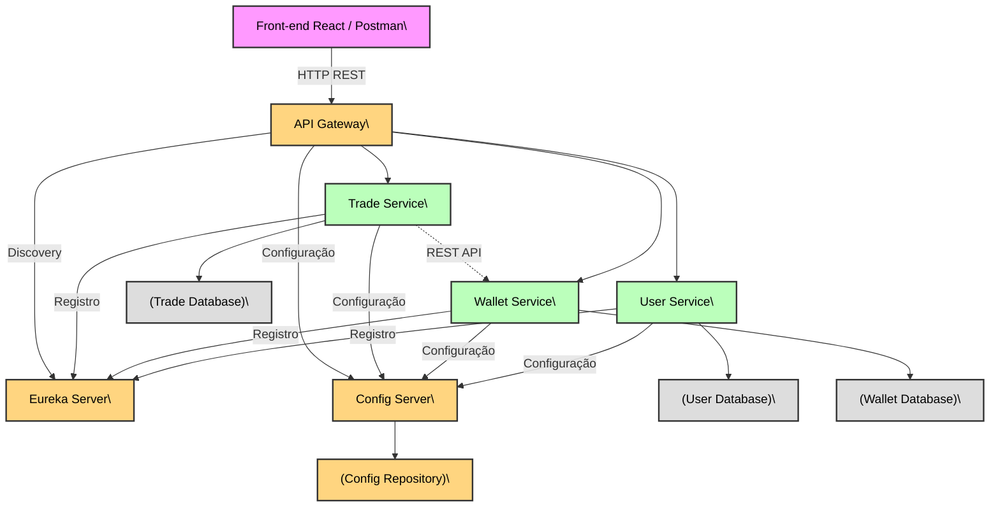
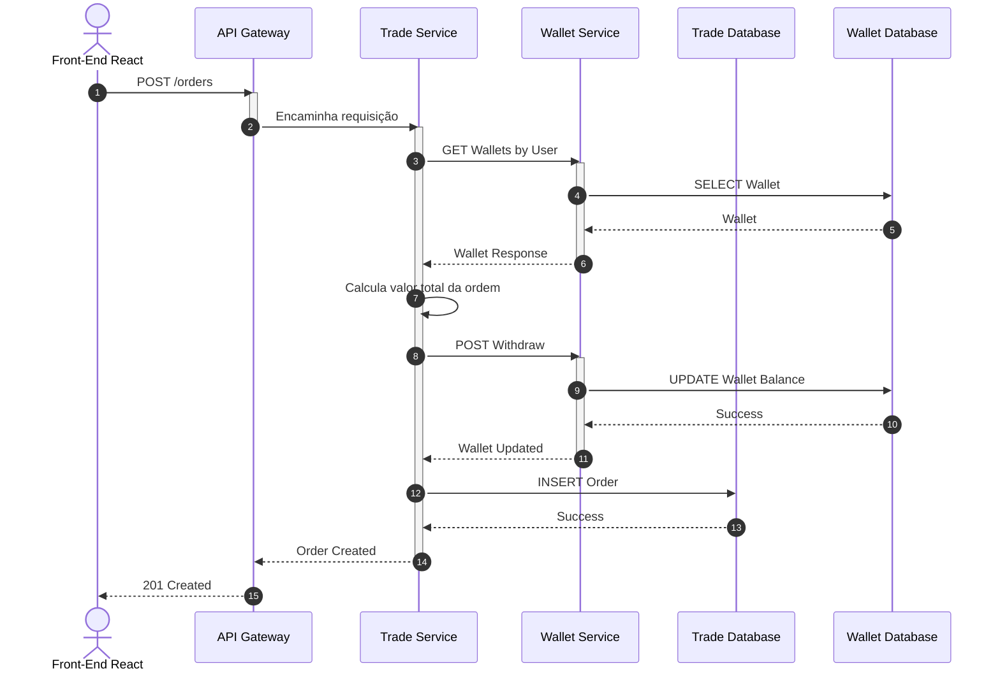

# Exchange API - Migração para Arquitetura de Microsserviços (TP3)

## Objetivo

O objetivo desta atividade foi migrar a aplicação desenvolvida no TP2, originalmente implementada como um sistema monolítico com persistência em banco de dados, para uma arquitetura baseada em microsserviços.

A proposta teve como foco aplicar os conceitos de desacoplamento, modularização e escalabilidade, permitindo que diferentes partes do sistema possam evoluir de forma independente.

---

### Desenvolvimento

Para atender aos requisitos do TP3, a aplicação foi refatorada, separando as responsabilidades anteriormente concentradas em um único sistema.

As principais alterações realizadas foram:

- Separação da lógica de negócio em microsserviços independentes;
- Exposição das funcionalidades através de APIs REST;
- Manutenção da camada de persistência existente;
- Isolamento das responsabilidades de cada domínio da aplicação;
- Utilização de containers Docker para facilitar a execução do ambiente;
- Organização da arquitetura visando maior escalabilidade e facilidade de manutenção.

A comunicação entre os componentes ocorre por meio de requisições HTTP, permitindo que cada serviço execute suas responsabilidades de forma isolada.

---

## 🛠️ Tecnologias e Versões Utilizadas

### Back-End

- **Linguagem:** Java 25
- **Framework:** Spring Boot 4.1.1
- **Gerenciamento de Dependências:** Maven
- **Bibliotecas Principais:**
  - `Spring Web` (APIs RESTful)
  - `Spring Security` (Autenticação e Proteção de Rotas)
  - `Spring Boot Validation` (Validações de DTOs com Jakarta)
  - `Lombok` (Redução de código boilerplate)
  - `Spring Boot Actuator` (Saúde da API)
  - `Spring Cloud 2025.1.3` (Cloud Infrastructure)
  - `Spring Cloud Gateway` (Roteamento centralizado de requisições)
  - `Eureka Discovery Server` (Descoberta e registro de serviços)
  - `Spring Config Server` (Configuração centralizada dos microsserviços)

### Front-End (Interface do Usuário)

- **Biblioteca Base:** React (v18+) com TypeScript (tipagem estática rigorosa).
- **Build Tool & Bundler:** Vite (configuração rápida e variáveis de ambiente).
- **Roteamento:** `react-router-dom` com implementação de rotas privadas (proteção de acesso ao painel administrativo).
- **Estilização e UI:** Tailwind CSS para estilização utilitária ágil e responsiva, juntamente com `lucide-react` para iconografia moderna.
- **Arquitetura e Boas Práticas:**
  - Componentização: Divisão clara entre `pages`, `components`, `hooks` e `types`.
  - Separação de Responsabilidades: Uso de Custom Hooks (como `useUsers`) para isolar regras de negócio, controle de estado e chamadas à API da camada de visualização.
- **Comunicação e Resiliência (Mock Mode):**
  - Consumo da API REST através de chamadas assíncronas com `fetch`.
  - **Sandbox Local (Fallback):** Mecanismo automático que detecta quando o backend está offline e ativa um modo de simulação em memória. Isso permite testar 100% das operações de CRUD na interface visual sem dependência do servidor ativo.
- **UX (Experiência do Usuário):**
  - Sistema próprio de notificações flutuantes (Toast) com temporizadores e animações.
  - Monitoramento em tempo real do status da API (Ping a cada 30s).
  - *Empty States* dinâmicos que orientam o usuário caso o banco ou simulador estejam vazios.
  - Autenticação simulada baseada em `localStorage`.

### Persistência

- Postgres 18 (configurável via Docker)

> [!TIP]
> Configure outro banco de dados facilmente no docker-compose.yml.

```env
DB_URL: jdbc:postgresql://wallet-db:5433/wallet_db
DB_USER: postgres
DB_PASSWORD: postgres # PLEASE CHANGE !
DB_DRIVER: org.postgresql.Driver
DB_DIALECT: org.hibernate.dialect.PostgreSQLDialect
```

#### Exemplo da configuração para MySQL

```env
DB_URL: jdbc:mysql://wallet-db:3306/wallet_db?serverTimezone=UTC&useSSL=false
DB_USER: root
DB_PASSWORD: mysql # PLEASE CHANGE !
DB_DRIVER: com.mysql.cj.jdbc.Driver
DB_DIALECT: org.hibernate.dialect.MySQLDialect
```

> [!WARNING]
> Não esqueça de alterar o banco de dados no pom.xml da mesma forma.

### Infraestrutura

- Docker
- Docker Compose

---

## 🗺️ Modelagem Estratégica DDD: Domínios, Subdomínios e Bounded Contexts

Para projetar a API da Exchange, foi dividido o problema de negócio utilizando a modelagem estratégica do **Domain-Driven Design (DDD)** que permitiu separar as regras complexas de execução de transações da infraestrutura básica de gerenciamento de contas e saldos.

### 1. Espaço de Problema (Domínios e Subdomínios)

- **Core Domain (Domínio Central):** `Motor de Negociação (Trade / Exchange)`
  - O coração do produto, onde o valor é entregue diretamente ao cliente através da execução de ordens de compra e venda de criptomoedas de forma ágil e segura.

- **Supporting Subdomain (Subdomínio de Suporte):** `Identity & Access (Gestão de Usuários)`
  - Essencial para o funcionamento do sistema financeiro (identificação do cliente), mas não é o diferencial competitivo que gera receita direta para a Exchange.

- **Generic Subdomain (Subdomínio Genérico):** `Gestão de Carteiras (Wallet & Ledger)`
  - Lógica de controle de saldos em moedas fiduciárias (USD) e criptoativos (BTC). Mecanismos de débito/crédito são problemas já resolvidos no mercado e poderiam ser delegados a provedores genéricos (BaaS), mas aqui foram implementados para gerenciar a liquidez das operações localmente.

### 2. Espaço de Solução (Bounded Contexts)

Foi possível identificar três **Bounded Contexts** (Contextos Delimitados) claros no monólito, cada um possuindo sua própria linguagem ubíqua e responsabilidades bem definidas:

| Bounded Context | Domínio/Subdomínio Associado      | Principais Agregados / Entidades | Responsabilidade Principal                                                                                                                            |
|-----------------|-----------------------------------|----------------------------------|-------------------------------------------------------------------------------------------------------------------------------------------------------|
| Trade Context   | Core Domain (Negociação)          | Order (Aggregate Root)           | Controlar a criação de ordens (compra/venda), calcular custos totais baseados no preço de mercado e registrar o status da transação.                  |
| Wallet Context  | Generic Subdomain (Carteiras)     | Wallet (Aggregate Root)          | Gerenciar os saldos individuais de cada ativo (fiduciário ou cripto), processando depósitos, saques e verificando fundos antes de aprovar transações. |
| User Context    | Supporting Subdomain (Identidade) | User (Aggregate Root)            | Manter os dados cadastrais básicos necessários para vincular as carteiras financeiras e o histórico de ordens ao proprietário correto.                |

### Arquitetura e Padrões

- **Design de Software:** Evolução do padrão **Monólito Modular** para uma arquitetura baseada em **Microsserviços**, mantendo a separação de responsabilidades através das camadas Controller, Service e Repository em cada serviço. Essa abordagem promove baixo acoplamento, alta coesão e independência de implantação dos componentes da aplicação.

- **Domain-Driven Design (DDD):** Os *Bounded Contexts* (`User`, `Wallet`, `Trade`) anteriormente organizados de forma lógica dentro do monólito foram transformados em serviços independentes, preservando os limites do domínio de negócio e fortalecendo o isolamento funcional entre os contextos.

- **Estratégia de Persistência (Escopo TP3):** A persistência foi descentralizada seguindo o princípio **Database per Service**, permitindo que cada microsserviço seja responsável pelos seus próprios dados. Foram mantidas as integrações com **Spring Data JPA**, **Hibernate** e bancos relacionais, garantindo independência dos repositórios e redução do acoplamento entre domínios.

- **Comunicação entre Serviços:** Implementação de comunicação síncrona via **REST APIs**, permitindo a colaboração entre os microsserviços de forma desacoplada. Os contratos de integração foram definidos através de endpoints específicos para troca de informações entre os domínios da aplicação.

- **Observabilidade e Resiliência:** Estrutura preparada para monitoramento individual dos serviços, facilitando identificação de falhas, rastreamento de requisições e manutenção independente dos componentes distribuídos.

- **Design de API:** Cada microsserviço expõe uma API RESTful *Stateless*, mantendo a padronização de respostas, contratos bem definidos e utilização adequada dos códigos de status HTTP para representar o resultado das operações.

- **Tratamento de Exceções:** Utilização de interceptadores globais de exceção em cada serviço, garantindo tratamento consistente para regras de negócio, validações e recursos inexistentes, mantendo uniformidade nas respostas de erro da arquitetura distribuída.

- **Padrões de Projeto Aplicados:** Uso de *DTO (Data Transfer Object)* para isolamento dos contratos de comunicação, *Builder Pattern* para criação consistente das entidades de domínio e *Repository Pattern* através do Spring Data JPA para abstração da camada de persistência.

- **Containerização e Implantação:** Utilização do **Docker** para empacotamento dos microsserviços e padronização do ambiente de execução, simplificando o processo de implantação, testes e escalabilidade dos componentes da solução.

---

## 💾 Modelagem de Dados e Arquitetura (Microsserviços & Clean Code)

A arquitetura do projeto foi evoluída seguindo os princípios de **Clean Code**, **Domain-Driven Design (DDD)** e arquitetura de **Microsserviços**. Os contextos de negócio, anteriormente organizados dentro de um Monólito Modular, foram desacoplados em serviços independentes, cada um responsável por seu domínio, regras de negócio e camada de persistência.

A modelagem foi estruturada de forma a preservar a separação clara entre domínio, aplicação e infraestrutura, mantendo as regras de negócio isoladas dos detalhes tecnológicos. Cada microsserviço possui autonomia sobre seus dados, adotando o princípio de **Database per Service**, reduzindo o acoplamento entre módulos e favorecendo a evolução independente da solução.

Essa abordagem garante maior encapsulamento, facilita a manutenção e escalabilidade da aplicação, além de permitir que os serviços sejam desenvolvidos, implantados e versionados de forma independente, sem comprometer a consistência das regras centrais do domínio.

---

## 📊 Arquitetura do Sistema

Abaixo estão os diagramas que ilustram a separação de responsabilidades e o fluxo de dados da nossa API.

### 1. Diagrama de Componentes

Este diagrama demonstra a composição da arquitetura distribuída, incluindo Service Discovery, Config Server, API Gateway e os microsserviços responsáveis pelos domínios de negócio.


```mermaid
graph TD
    classDef client fill:#f9f,stroke:#333,stroke-width:2px,color:#000;
    classDef infra fill:#ffd580,stroke:#333,stroke-width:2px,color:#000;
    classDef service fill:#bfb,stroke:#333,stroke-width:2px,color:#000;
    classDef database fill:#ddd,stroke:#333,stroke-width:2px,color:#000;

    Client[Front-end React / Postman\]:::client

    Gateway[API Gateway\]:::infra
    Eureka[Eureka Server\]:::infra
    Config[Config Server\]:::infra
    Repo["(Config Repository)\"]:::infra

    UserService[User Service\]:::service
    WalletService[Wallet Service\]:::service
    TradeService[Trade Service\]:::service

    UserDB["(User Database)\"]:::database
    WalletDB["(Wallet Database)\"]:::database
    TradeDB["(Trade Database)\"]:::database

    Client -->|HTTP REST| Gateway

    Gateway --> UserService
    Gateway --> WalletService
    Gateway --> TradeService

    Config --> Repo

    UserService -->|Configuração| Config
    WalletService -->|Configuração| Config
    TradeService -->|Configuração| Config
    Gateway -->|Configuração| Config

    UserService -->|Registro| Eureka
    WalletService -->|Registro| Eureka
    TradeService -->|Registro| Eureka
    Gateway -->|Discovery| Eureka

    UserService --> UserDB
    WalletService --> WalletDB
    TradeService --> TradeDB

    TradeService -.->|REST API| WalletService
```

### 2. Diagrama de Sequência (Caso de Uso: Nova Ordem de Compra)

O fluxo abaixo ilustra a comunicação distribuída entre Gateway, Trade Service e Wallet Service durante a criação de uma nova ordem.


```mermaid
sequenceDiagram
    autonumber

    actor Client as Front-End React

    participant GW as API Gateway
    participant TS as Trade Service
    participant WS as Wallet Service

    participant TDB as Trade Database
    participant WDB as Wallet Database

    Client->>GW: POST /orders

    activate GW
    GW->>TS: Encaminha requisição
    deactivate GW

    activate TS

    TS->>WS: GET Wallets by User
    activate WS

    WS->>WDB: SELECT Wallet
    WDB-->>WS: Wallet

    WS-->>TS: Wallet Response
    deactivate WS

    TS->>TS: Calcula valor total da ordem

    TS->>WS: POST Withdraw
    activate WS

    WS->>WDB: UPDATE Wallet Balance
    WDB-->>WS: Success

    WS-->>TS: Wallet Updated
    deactivate WS

    TS->>TDB: INSERT Order
    TDB-->>TS: Success

    TS-->>GW: Order Created

    deactivate TS

    GW-->>Client: 201 Created
```

## 🐳 Infraestrutura e Execução (Docker)

Para garantir um ambiente de desenvolvimento padronizado e facilitar a execução do banco de dados relacional, o projeto utiliza o Docker. A infraestrutura do PostgreSQL, Node.js (Front-end) e API estão configuradas no arquivo `docker-compose.yml`.

### **Pré-requisitos:**

- **Docker** e **Docker Compose** instalados na máquina.
- **Java 25** e **Maven** (para os testes locais).

#### Passo a passo para execução usando Docker

1. Na raiz do projeto, suba os containeres do banco de dados, da API e do front-end em segundo plano:

   ```bash
   docker compose up -d
   ```

    Ao iniciar, o Hibernate criará e atualizará as tabelas automaticamente (`ddl-auto=update`).

2. Você pode acessar o front-end através da porta 5173 (`localhost:5173`) e a API pela porta 8080 (`localhost:8080`).

#### Passos para execução local e de testes

1. Para rodar a API localmente, execute a classe principal da aplicação ou utilize o comando Maven:

    ```bash
    mvn spring-boot:run
    ```

2. Para executar a suíte de testes (que utiliza o banco H2 em memória e não interfere no banco de dados principal), rode:

    ```bash
    mvn clean test
    ```

---

### Benefícios Obtidos

A adoção de uma arquitetura baseada em microsserviços proporcionou diversos benefícios para a aplicação:

- Redução do acoplamento entre módulos;
- Melhor organização do código-fonte;
- Maior facilidade de manutenção;
- Possibilidade de evolução independente dos serviços;
- Melhor preparação da aplicação para cenários de escalabilidade;
- Implantação mais flexível dos componentes.

---

### Resultados

A aplicação manteve todas as funcionalidades implementadas no TP2, porém agora distribuídas entre microsserviços independentes.

Os testes realizados demonstraram que:

- Os serviços conseguem se comunicar corretamente;
- A persistência dos dados continua funcionando normalmente;
- Os componentes podem ser executados de forma independente;
- O ambiente pode ser reproduzido utilizando Docker.

---

### Conclusão

A migração do monólito para microsserviços permitiu aplicar conceitos fundamentais de Engenharia de Software Escalável, tornando a aplicação mais modular, flexível e preparada para crescimento futuro. A nova arquitetura facilita a manutenção do sistema e possibilita a evolução dos componentes de forma independente.
